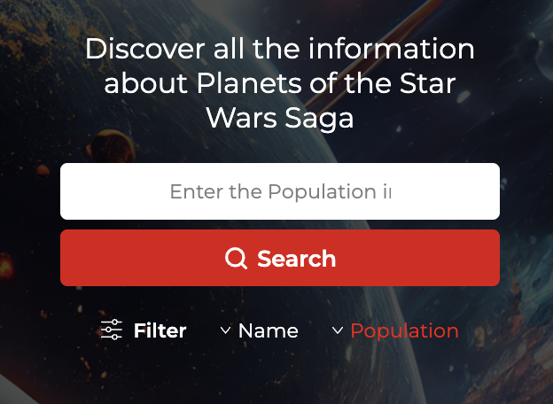
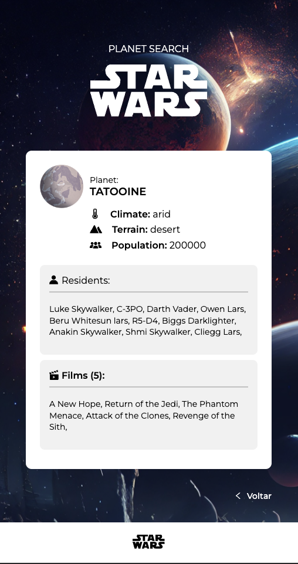
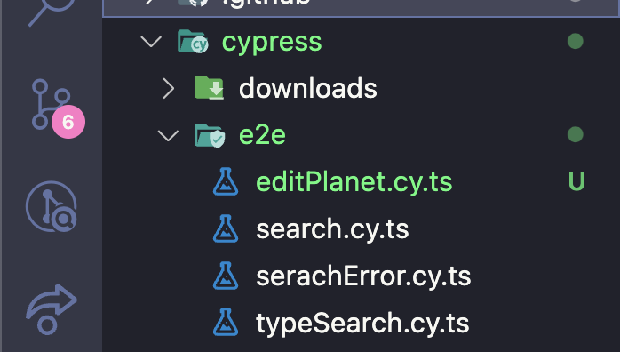

## Desafio Técnico: Aplicativo de Informações sobre Planetas de Star Wars

> Status: concluído 🚀

### Descrição sobre o desafio 💻

Crie um aplicativo da web React que permite aos usuários buscar informações sobre planetas da saga
Star Wars usando a API pública do Star Wars (SWAPI). O aplicativo deve permitir que os usuários
possam buscar pelo nome de um planeta e, em seguida, exiba informações detalhadas sobre esse
planeta, incluindo nome, clima, terreno, população, filmes em que apareceu e residentes (caso haja).

### Requisitos Funcionais:

- Interface de Busca:
  > Faça filtro por: nome e população. ✅
- Chamada de API:
  > Faça uma chamada à API pública do Star Wars (SWAPI) para obter informações sobre o planeta
  > inserido pelo usuário. Exibição de Informações ✅
- Exiba as seguintes informações sobre o planeta: Nome do planeta, Clima, Terreno, População,Filmes
  em que o planeta apareceu (lista de títulos) e sua contagem, Residentes do planeta (caso haja,
  liste seus nomes). ✅
- Importante: a SWAPI não retorna as imagens dos planetas, nós passaremos os links do S3 das imagens
  de cada planeta, você deverá ao exibir os planetas exibir também sua respectiva imagem, mesclando
  da maneira mais performática possível. ✅

> Edição de Informações

- Embora a API não forneça endpoints para edição, você deverá permitir com que o nome dos planetas
  possa ser alterado localmente, de forma que se a página for atualizada, os dados voltam a ser como
  eram originalmente retornados pela API. ✅

### Requisitos Técnicos:

- Use React para criar o aplicativo. ✅
- Faça chamadas à API SWAPI para obter informações sobre os planetas (documentação da API:
  https://swapi.dev/documentation#planets). ✅
- Gerencie o estado do aplicativo de forma apropriada, faça um código performático e bem construído.
  ✅
- Trate erros de chamada à API (por exemplo, se o planeta não for encontrado) e forneça feedback ao
  usuário. ✅
- O Design será fornecido por nós e deverá ser replicado da maneira mais fiel possível. ✅

### Pontos Extras (Opcionais):

- Aplicação de TDD. ✅ Entrega e prazo: A partir do recebimento deste documento você terá 3 dias
  úteis para entregar. A entrega poderá ser feita de duas formas, ou nos enviar um arquivo zipado do
  projeto e/ou link para o repositório do projeto e as instruções para rodar. Também poderá ser
  colocado em um servidor gratuito (Vercel, Netlify, etc) e nos enviado o link da aplicação. ✅

### Avaliação:

O objetivo deste desafio é avaliar a capacidade do desenvolvedor de trabalhar com chamadas de API,
manipular dados e criar uma experiência de usuário agradável. Avaliamos seu código, implementações
utilizadas, design e funcionalidade e performance geral do aplicativo.

### 🔖 Design/Layout

Abaixo segue o Design e também o link para o figma do mesmo.
https://www.figma.com/file/Z7rryquU677ifYXJIWCipC/Star-Wars?type=design&node-id=0%3A1&mode=design&t
=nGI8aWVhNX6L3EBh-1

### Tecnologias Usadas

- React
- Typescript
- Cypress

###

### link de homologação

> https://start-wars-app.vercel.app/

#### 🎨 Layout Desktop

<h1 align="center">
  
</h1>

> Resultado da pesquisa por Nome ou por População

<h1 align="center">
  
</h1>

> Caso queira editar o nome do planeta, clique em cima do nome e aparecerá um modal para ser
> efetuado a mudança.

> Para este caso de uso foi criado um hook chamado useLocaStoarage para persistir os dados
> localmente.

<h1 align="center">
  
</h1>

## Caso queira efetuar a pesquisa por população clique em cima do nome população

<h1 align="center">
  
</h1>

#### Mobile

<h1 align="center">
  
  
</h1>

### Teste automatizado de Pesqusia de planeta com Cypress

- Para executar o cyprees execute o comando :
  > npx cypress open

* Alguns teste realizados :

- Verificar mensagens de feedback para usuário caso o planeta não seja encontrado
- Verificar resultado da pesquisa
- Verificar Edição do nome do planeta

> Teste realizado para pesquisar planeta.

## Como executar o projeto ? 🚀

> Clone este repositório :

1 - git clone git@github.com:danrleyney2210/start-wars-app.git

2 - Acesse a pasta do projeto no seu terminal/cmd:

> cd start-wars-app

3 - check se esta na banch master - Instale as dependências :

> **yarn** ou **npm install**

4 - Execute a aplicação

> **yarn start** ou **npm run start**

#### Comandos para build

> yarn build

# 🛠 Tecnologias

> Principais dependências usadas no projeto: 🔥

- Website (React + RCA + Typescript)

- React Icons - Biblioteca de icones.

- Styled Components - CSS-in-js

- Prettier - Formatador de código opinativo.

- Cypress - Para testes automatizado e testes em library.

- Eslint - Ferramenta para identificar e relatar os padrões encontrados no código ECMAScript /
  JavaScript, com o objetivo de tornar o código mais consistente e evitar bugs.

- Axios - Cliente HTTP baseado em promessa para node. jse o navegador.

- react-toastify - Para Feedback e alertas personalizados.

Veja o arquivo <a>package.json</a>

> Utilitários

- Protótipo: Figma
- Editor: Visual Studio Code

---

### 🦸 Desenvolvedor 🤘

Feito com ❤️ por Danrley Ney 👋🏽 Entre em contato!

> Email: danrley.dev@gmail.com

> www.danrley.dev

> Twitter: @danrleyney
